# Architecture Diagrams

## 1. High-Level System Architecture

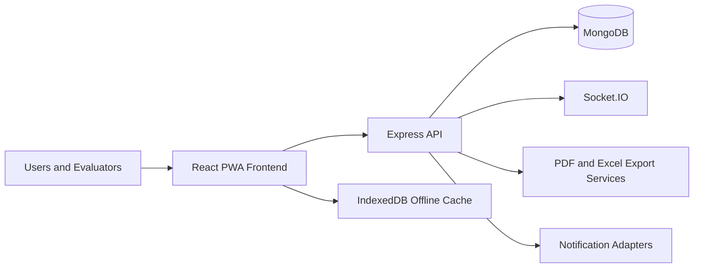

## 2. Frontend Architecture

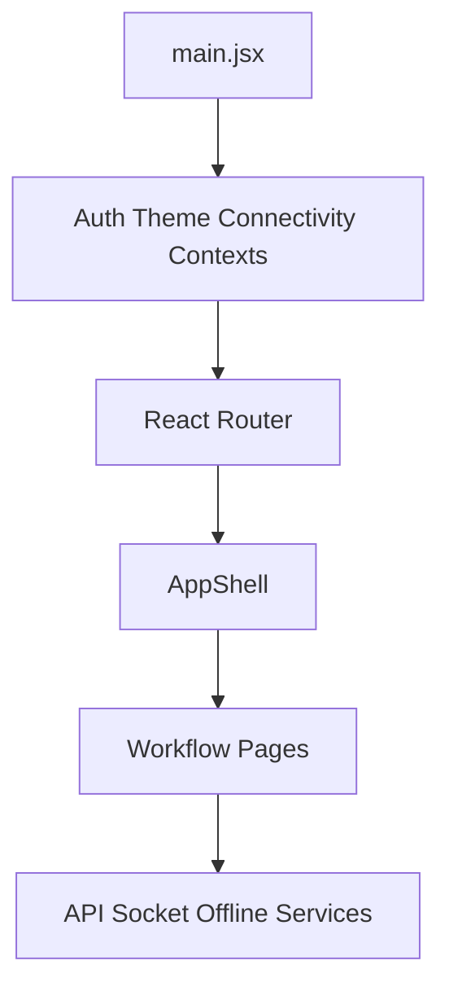

## 3. Backend Layered Architecture

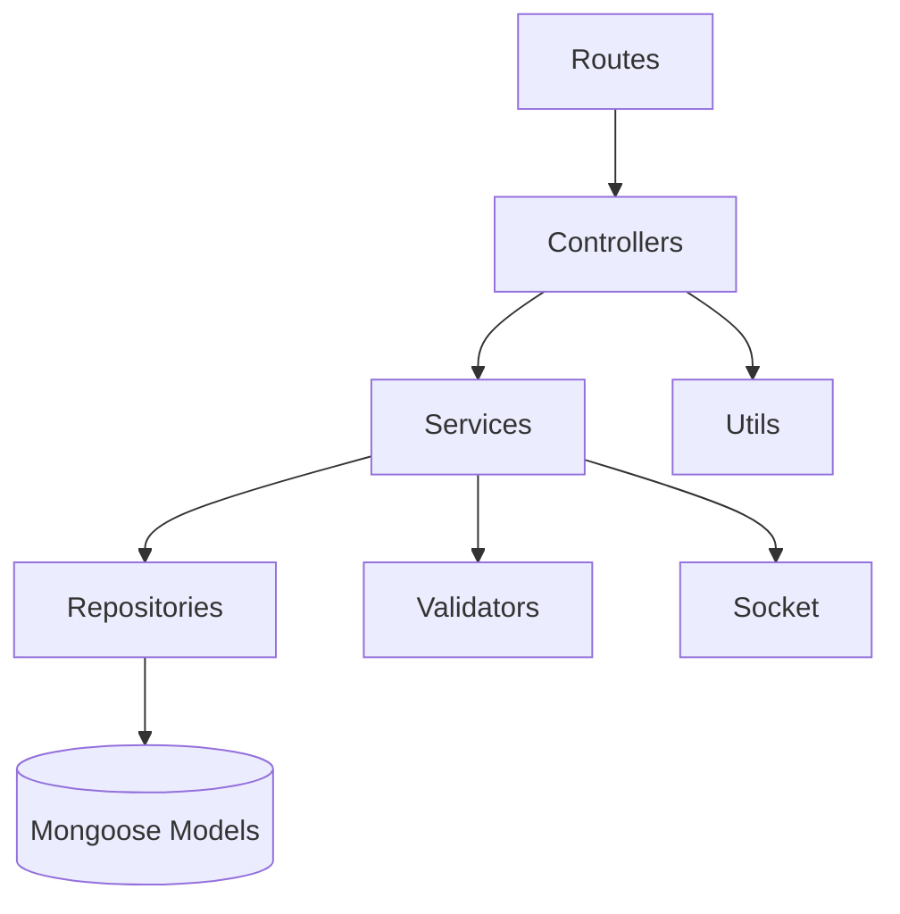

## 4. Database Relationship Overview

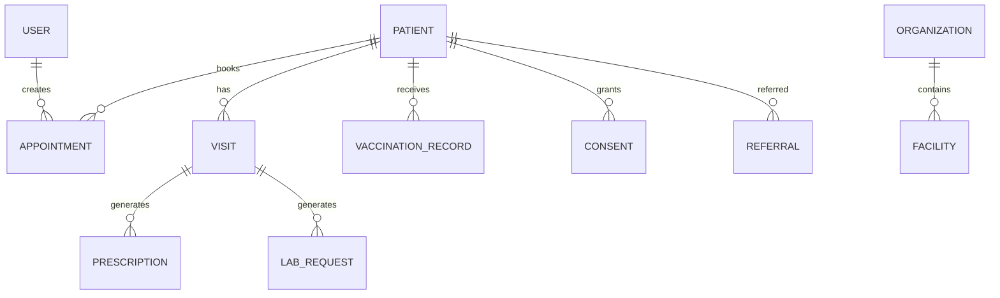

## 5. Authentication Flow

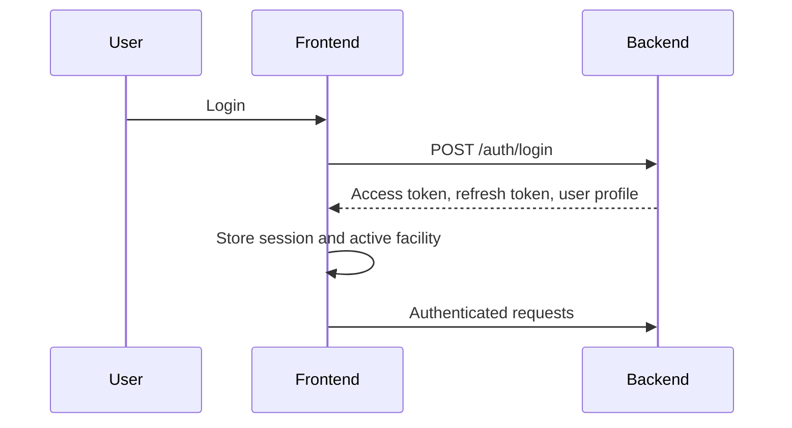

## 6. Patient Registration Flow

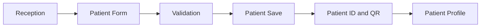

## 7. Appointment And Queue Flow

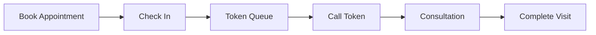

## 8. Consultation Flow

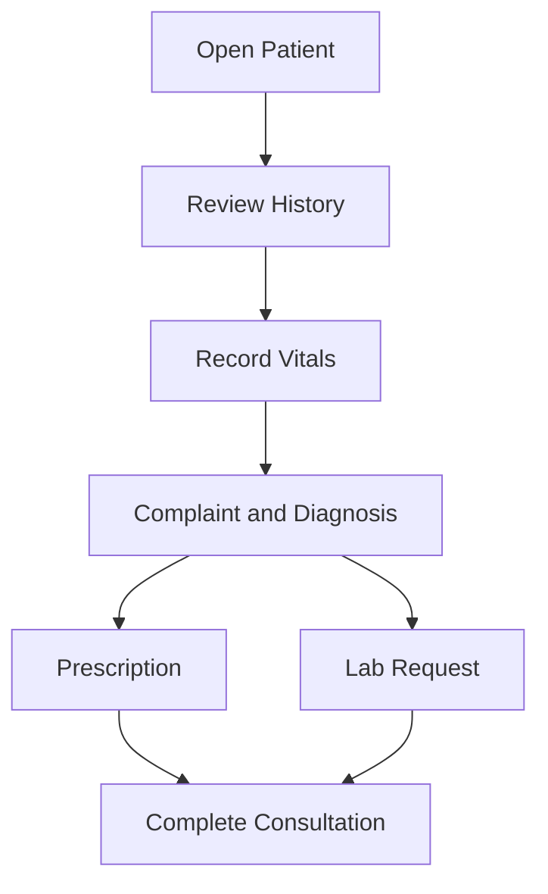

## 9. Pharmacy Workflow

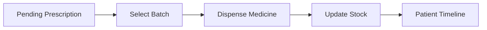

## 10. Laboratory Workflow

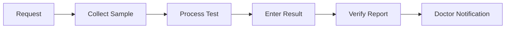

## 11. Vaccination Workflow

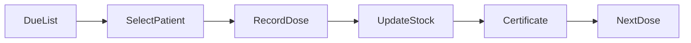

## 12. Notification Flow

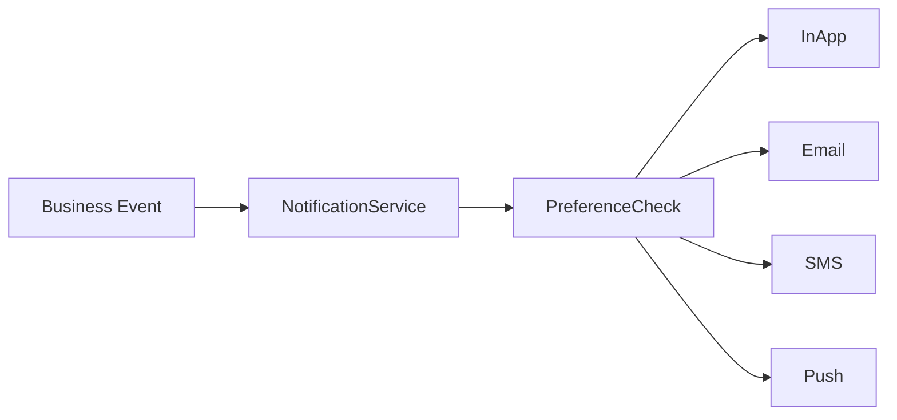

## 13. Offline Synchronization Flow

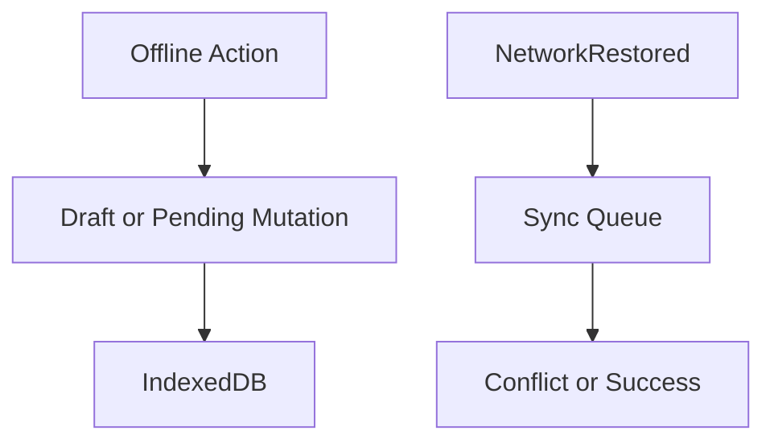

## 14. Multi-PHC Tenant Hierarchy

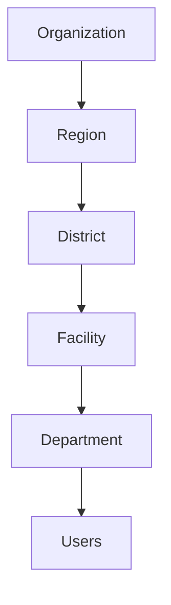

## 15. Consent And Referral Flow

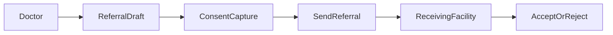

## 16. AI Human-Review Flow

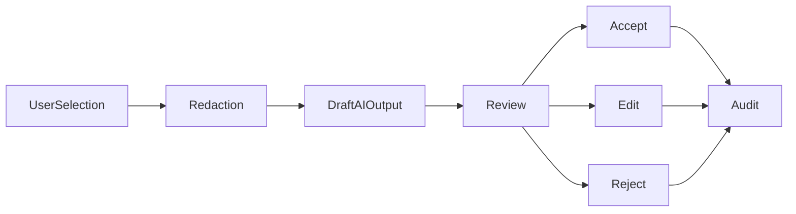

## 17. Deployment Architecture

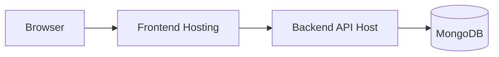

## 18. CI/CD Pipeline

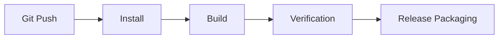
