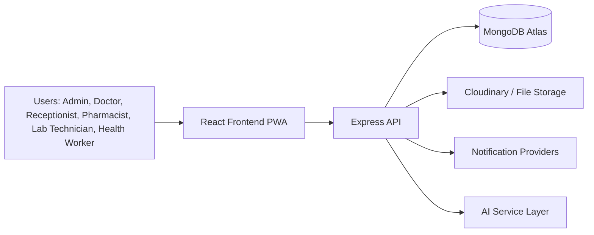

# RHMS Architecture

## System Vision

The RHMS is designed as a modular healthcare operations platform for rural primary health centres with future support for multiple PHCs, centralized analytics, and AI-assisted workflows.

## Architecture Principles

- Domain-oriented modularization
- Separation of controllers, services, repositories, validators, and middleware
- Reusable frontend layouts, components, hooks, and service clients
- Secure-by-default API design
- Offline-ready frontend workflows
- AI-ready orchestration without coupling core care workflows to inference providers

## High-Level Topology



## Backend Layers

```text
routes -> controllers -> services -> repositories -> models
                        |-> validators
                        |-> helpers / utils
                        `-> external integrations
```

## Frontend Layers

```text
app shell -> route modules -> feature components -> hooks -> api services -> shared UI primitives
```

### Frontend Design Layer

```text
theme context -> design tokens -> motion primitives -> reusable UI components -> feature modules
```

## Core Product Modules

1. Identity and Access
2. Patient Registration
3. Longitudinal Visit History
4. Appointment and Token Queue
5. Doctor Workspace
6. Pharmacy and Inventory
7. Laboratory
8. Vaccination and Follow-ups
9. Reports and Analytics
10. Notifications and Communication
11. Audit and Compliance
12. Offline Sync and PWA

## Role Boundaries

- Admin: platform setup, users, policy, reports, audits
- Receptionist: registrations, appointments, queue, check-in
- Doctor: consultations, prescriptions, lab requests, notes
- Pharmacist: dispensing, stock, returns, expiry monitoring
- Lab Technician: sample intake, report generation, status updates
- Health Worker: follow-ups, vaccination, outreach, village programs

## Deployment Units

- `frontend`: deploy to Vercel or static hosting
- `backend`: deploy to Render or Railway
- `database`: MongoDB Atlas cluster
- `assets`: Cloudinary

## Security Controls

- JWT access control
- role-based authorization
- request validation with Zod
- secure headers with Helmet
- rate limiting
- consistent audit logging
- environment-based secrets
- future CSRF and refresh-token hardening

## Phase Sequencing

### Phase 1

- architecture
- data model
- UI system
- API contracts

### Phase 2

- auth
- patients
- visits
- queue
- audit

### Phase 3

- dashboard
- role portals
- pharmacy
- lab
- reports
- offline sync

### Phase 4

- tests
- observability
- deployment
- optimization
- docs
